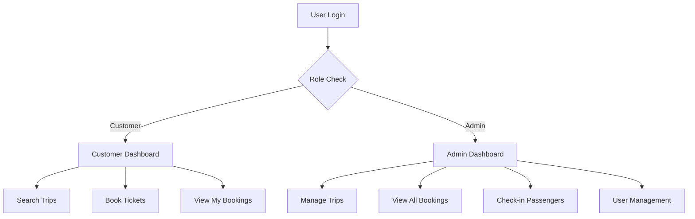

# 🔐 **Phân Quyền Hệ Thống Đặt Vé Xe**

## 📋 **Tổng Quan**

Hệ thống có **2 role chính**:

- **`Customer`** - Khách hàng thông thường
- **`Admin`** - Quản trị viên (gộp cả Staff)

---

## 👤 **Customer (Khách hàng)**

### ✅ **Chức năng được phép:**

- 🔍 **Tìm kiếm chuyến xe** - Tìm theo điểm đi/đến, ngày
- 📋 **Xem danh sách chuyến xe** - Xem tất cả chuyến xe có sẵn
- 🚌 **Xem chi tiết chuyến xe** - Thông tin xe, giờ khởi hành, giá vé
- 💺 **Chọn ghế ngồi** - Xem sơ đồ ghế và chọn ghế trống
- 🎫 **Đặt vé** - Tạo booking mới
- 📱 **Xem vé của mình** - Danh sách vé đã đặt
- ❌ **Hủy vé** - Hủy vé chưa thanh toán
- 🔐 **Đăng nhập/Đăng ký** - Quản lý tài khoản cá nhân

### ❌ **Chức năng bị cấm:**

- Quản lý chuyến xe
- Check-in khách hàng
- Xem tất cả booking
- Quét QR code
- Quản lý người dùng

---

## 👨‍💼 **Admin (Quản trị viên)**

### ✅ **Chức năng được phép:**

#### 🏠 **Dashboard & Thống kê**

- 📊 **Dashboard tổng quan** - Thống kê tổng số vé, chuyến xe, người dùng
- 📈 **Báo cáo doanh thu** - Thống kê theo ngày/tuần/tháng

#### 🚌 **Quản lý Chuyến Xe**

- ➕ **Thêm chuyến xe mới** - Tạo chuyến xe với thông tin đầy đủ
- ✏️ **Sửa chuyến xe** - Cập nhật thông tin chuyến xe
- 🗑️ **Xóa chuyến xe** - Xóa chuyến xe không cần thiết
- 📋 **Xem tất cả chuyến xe** - Danh sách đầy đủ các chuyến xe

#### 🎫 **Quản lý Đặt Vé**

- 📋 **Xem tất cả booking** - Danh sách đặt vé của tất cả khách hàng
- ❌ **Hủy vé bất kỳ** - Hủy vé của bất kỳ khách hàng nào
- 🔍 **Tìm kiếm booking** - Tìm theo tên, số điện thoại, mã vé

#### ✅ **Check-in & Xác thực**

- 📱 **Check-in khách hàng** - Xác nhận khách hàng lên xe
- 🔍 **Quét QR code** - Quét mã QR để xác thực vé
- ✅ **Xác thực vé** - Kiểm tra tính hợp lệ của vé

#### 👥 **Quản lý Người dùng**

- 📋 **Xem danh sách người dùng** - Tất cả tài khoản trong hệ thống
- ➕ **Tạo tài khoản Admin** - Thêm quản trị viên mới
- 🔄 **Cập nhật thông tin người dùng** - Sửa thông tin cá nhân

#### 📊 **Báo cáo & Audit**

- 📝 **Xem audit log** - Lịch sử hoạt động của hệ thống
- 📊 **Báo cáo chi tiết** - Thống kê theo nhiều tiêu chí

---

## 🔗 **API Endpoints theo Role**

### 🌐 **Public APIs (Không cần đăng nhập)**

```
POST /api/auth/register
POST /api/auth/login
GET  /api/trips/search
GET  /api/trips/{id}
```

### 👤 **Customer APIs (Cần đăng nhập)**

```
GET  /api/bookings/my-bookings
POST /api/bookings
PUT  /api/bookings/{id}/cancel
GET  /api/bookings/{id}
```

### 👨‍💼 **Admin APIs (Cần đăng nhập + Role = Admin)**

```
GET  /api/admin/dashboard
GET  /api/admin/trips
GET  /api/admin/bookings
GET  /api/admin/users
POST /api/admin/checkin
GET  /api/admin/verify
DELETE /api/admin/bookings/{id}
```

---

## 🛡️ **Bảo mật**

### 🔐 **JWT Token**

- Mỗi user đăng nhập sẽ nhận JWT token
- Token chứa thông tin: `UserId`, `Role`, `Email`
- Token có thời hạn và cần refresh

### 🚫 **Authorization Middleware**

- Tất cả API đều kiểm tra JWT token
- Admin APIs kiểm tra thêm `Role = "Admin"`
- Trả về `403 Forbidden` nếu không có quyền

### 📝 **Audit Logging**

- Ghi lại tất cả hoạt động quan trọng
- Theo dõi ai làm gì, khi nào
- Bảo mật và tuân thủ quy định

---

## 🎯 **Ví dụ Sử dụng**

### 👤 **Customer đặt vé:**

1. Đăng nhập với role `Customer`
2. Tìm kiếm chuyến xe
3. Chọn ghế và đặt vé
4. Xem vé trong "My Bookings"

### 👨‍💼 **Admin quản lý:**

1. Đăng nhập với role `Admin`
2. Xem dashboard tổng quan
3. Quản lý chuyến xe
4. Check-in khách hàng
5. Xem báo cáo

---

## 🔄 **Workflow Phân Quyền**



---

## 📱 **Flutter App Integration**

### 🔧 **Cấu hình API**

```dart
// lib/config/api_config.dart
class ApiConfig {
  static const String localhostUrl = 'https://localhost:7000/api';
  static const bool useMockData = false; // Sử dụng real API
}
```

### 🎯 **Role-based Navigation**

```dart
// Kiểm tra role để điều hướng
if (user.role == 'Admin') {
  // Hiển thị Admin Dashboard
} else {
  // Hiển thị Customer Dashboard
}
```

---

## 🚀 **Kết luận**

Hệ thống phân quyền đơn giản với 2 role chính:

- **Customer**: Tập trung vào trải nghiệm đặt vé
- **Admin**: Quản lý toàn bộ hệ thống

Điều này giúp:

- ✅ Đơn giản hóa quản lý
- ✅ Bảo mật tốt hơn
- ✅ Dễ bảo trì và mở rộng
- ✅ Phù hợp với quy mô vừa và nhỏ
